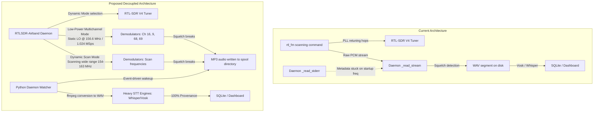

# Power-Efficient Multi-Channel VHF Monitoring Strategy (RTLSDR-Airband)

This plan details the migration of the VHF monitoring pipeline from sequential command-line scanning (`rtl_fm`) to a software-channelized, wideband receiver architecture using `RTLSDR-Airband`. This strategy solves the frequency metadata tracking issue and optimizes power efficiency on the solar-powered edge node.

## Architecture Comparison



---

## Technical Feasibility & Benefits

### 1. Dynamic Mode Selection (Power-Saving vs. Scanning)
To make the monitoring strategy configurable, the Python daemon will dynamically generate the `/home/pi/Projects/lhzn-io/lazy-buoy/configs/rtl_airband.conf` file based on SQLite system settings.

* **Max Power Savings (Multichannel Mode)**:
  * Trigger: When **only** Marine channels are enabled (`noaa_enabled = 0` and `emergency_enabled = 0`).
  * Configuration: Set the SDR to static multichannel mode at **`1.024 MSps`** centered at `156.600 MHz`. It monitors all 4 Marine channels simultaneously with **zero tuner retuning overhead** and minimal CPU/heat load.
* **Wide-Band Scanning Mode**:
  * Trigger: When **NOAA** or **Emergency/Police** channels are toggled **on**.
  * Configuration: Because the total frequency span (154.280 to 162.550 MHz) exceeds the RTL-SDR bandwidth, the daemon configures RTLSDR-Airband to use `mode = "scan"`. It physically hops the tuner LO between all enabled channels.
  * Frequency Provenance: In scan mode, RTLSDR-Airband appends the active frequency to the saved filename (e.g., `VHF_156475000_*.mp3`), allowing the Python daemon to identify the frequency with 100% accuracy.

### 2. Asynchronous Transcription Wakeup
The heavy Vosk/Whisper speech models are only loaded and run when a new audio file is saved (event-driven). The CPU and Hailo-8 M.2 coprocessor can remain in low-power idle states during silence.

---

## Proposed Changes

### 1. Database Layer

#### [MODIFY] [database.py](../../src/database.py)
* Add `emergency_enabled` initialization to the `system_settings` table (defaulting to `'1'`).

---

### 2. Web App API Layer

#### [MODIFY] [web_app.py](../../src/web_app.py)
* Update `/api/settings` GET and POST routes to handle `emergency_enabled` (boolean converted to `'1'` or `'0'`).

---

### 3. Frontend Dashboard UI

#### [MODIFY] [index.html](../../templates/index.html)
* Add a "Monitor Emergency & Police" checkbox right below the NOAA Weather checkbox in the settings card.
* Update `fetchSystemSettings()` and `saveSystemSettings()` to get and post the `emergency_enabled` checkbox status.

---

### 4. Build and Compilation on Remote Buoy
* Install required dependencies (`build-essential`, `cmake`, `pkg-config`, `libmp3lame-dev`, `libconfig++-dev`, `libfftw3-dev`, `librtlsdr-dev`).
* Clone and build `RTLSDR-Airband` from source on the remote Pi:
  ```bash
  git clone https://github.com/rtl-airband/RTLSDR-Airband.git
  cd RTLSDR-Airband && mkdir build && cd build
  cmake -DPLATFORM=generic ../
  make -j$(nproc)
  sudo make install
  ```

---

### 5. Service Daemon Updates

#### [MODIFY] [vhf_transcriber_daemon.py](../../src/vhf_transcriber_daemon.py)
* **RTLSDR-Airband Configuration Generator**:
  * Implement code to read `noaa_enabled` and `emergency_enabled` from the database.
  * Dynamically format and write `/home/pi/Projects/lhzn-io/lazy-buoy/configs/rtl_airband.conf`.
  * If only Marine is active, format it using `multichannel` mode with `centerfreq = 156.6` and `sample_rate = 1.024`.
  * If NOAA/Emergency is active, format it using `mode = "scan"` with the list of enabled frequencies.
* **Process Management**:
  * Instead of `rtl_fm`, launch `rtl_airband -c /home/pi/Projects/lhzn-io/lazy-buoy/configs/rtl_airband.conf -F` (run in foreground) as a subprocess.
  * Stop and restart the `rtl_airband` subprocess on settings configuration changes.
* **Event-Driven Spool Watcher**:
  * Set up a filesystem watcher to monitor the `logs/audio_in` directory for new `.mp3` files.
  * When a new `.mp3` file is detected:
    1. Wait for the file to be completely written.
    2. Parse the filename to extract the frequency (e.g., `156475000` -> `Marine-69`) and timestamp.
    3. Execute `/usr/bin/ffmpeg` to convert the `.mp3` to a standard mono 16 kHz `.wav` file in the `logs/audio` directory.
    4. Run the speech transcription engine (Vosk or Hailo Whisper) on the WAV file.
    5. Save the transcript to SQLite/LanceDB.
    6. Delete the temporary `.mp3` and `.wav` files once processed.

---

## Verification Plan

### Automated/Compilation Checks
- Verify syntax and dependencies of the updated `vhf_transcriber_daemon.py`:
  ```bash
  python -m py_compile lazy-buoy/src/vhf_transcriber_daemon.py
  ```

### Manual Verification
1. **RTLSDR-Airband Launch**: Verify that `rtl_airband` starts correctly and claims the tuner in the appropriate mode (multichannel vs. scan).
2. **Audio Capture Test**: Transmit on Channel 69 using the handheld Marine VHF radio. Check that `RTLSDR-Airband` successfully detects the squelch break, creates a new `.mp3` file named `VHF_156475000_*.mp3`, and closes it when the transmission ends.
3. **Daemon Event Test**: Verify that the Python daemon detects the `.mp3` file, converts it to WAV via `ffmpeg`, transcribes it, and logs the result under `Marine-69` in the SQLite database and dashboard.
