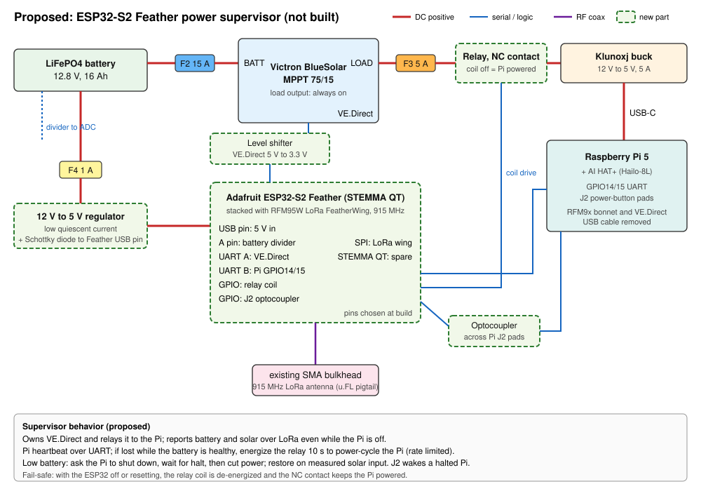

# Hardware: Enclosure, Power, and Wiring

As-built description of the lazy-buoy enclosure (Nanuk case), recorded 2026-10-08
from photographs and bench measurements.

## Components

| Function | Part | Interface | Notes |
| :--- | :--- | :--- | :--- |
| Compute | Raspberry Pi 5 | | Powered over USB-C; no RTC backup cell |
| AI accelerator | Raspberry Pi AI HAT+ 13 TOPS (Hailo-8L) | PCIe | Whisper tiny transcription |
| Charge controller | Victron BlueSolar MPPT 75/15 | VE.Direct (USB cable) | No Bluetooth; load output used to switch the Pi |
| Battery | GoldenMate LiFePO4, 12.8 V, 16 Ah (06/2025) | 6.3 mm spade terminals | Flat voltage curve: state of charge cannot be read from voltage |
| Solar panel | Newpowa 30 W, 12 V | 2-pin GX16 bulkhead | 100 W panel on order (see Upgrades) |
| 5 V supply | Klunoxj buck converter, 12 V to 5 V, 5 A | USB-C to the Pi | Does not advertise USB-PD current; the Pi reports a 900 mA supply |
| VHF receiver | RTL-SDR Blog V4 | Pi USB | rtl_airband, marine VHF channels |
| GNSS | u-blox ZED-F9P | USB via hub | RTK with NTRIP corrections |
| USB hub | unbranded, bus-powered | Pi USB | Powered from the Pi |
| LoRa radio | RFM9x | GPIO SPI | 902.5 MHz, 23 dBm |
| IMU | BNO08x | I2C (STEMMA QT) | |
| Temperature and humidity | HTU31D | I2C (STEMMA QT) | |
| Antenna entries | 3 SMA bulkheads | coax | Marine VHF/AIS, GNSS, 915 MHz LoRa |

## Power path and fusing

| Circuit | Fuse | Conductor | From | To |
| :--- | :--- | :--- | :--- | :--- |
| Solar (PV) | F1, 5 A blade | 18 to 20 AWG | GX16 bulkhead, positive pin | MPPT PV+ |
| Battery | F2, 15 A blade | | Battery positive | MPPT BATT+ |
| Load | F3, 5 A blade | | MPPT LOAD+ | Buck converter input positive |

Negative conductors run unfused to the matching MPPT terminals. On the bench, a
USB-C wall supply can replace the buck converter at the Pi's USB-C input; the two
sources are used either-or, never together. Shut the Pi down before switching sources.

## Power management

The sensor daemon (`src/sensor_lora_daemon.py`, flags in `configs/lhzn-sensor.service`)
reads the MPPT every 15 s and manages the load output over the VE.Direct HEX protocol:

| Condition | Action |
| :--- | :--- |
| Boot | Set MPPT load output to user-defined mode, disconnect 11.6 V, reconnect 13.2 V (written only if different) |
| Battery below 12.0 V for 3 consecutive valid readings | Sync, arm the RTC wake alarm (1 h), raise the MPPT disconnect level above the present voltage, halt |
| After halt | MPPT removes power from the load output; the RTC alarm is lost with power |
| Battery above 13.2 V (solar charging) | MPPT restores the load output; the Pi boots and the daemon restores the 11.6 V backstop |
| Frame without a voltage field, or below 6 V | Ignored (treated as a corrupt frame) |

## Upgrades required for the 100 W panel

The PV path is sized for the 30 W panel (short-circuit current about 1.8 A). The
100 W panel (short-circuit current 5.6 A) needs:

* F1 raised to 10 A (solar fuses are sized at 1.56 times short-circuit current or more).
* PV conductors of 14 AWG or heavier.
* A case entry rated above 10 A, such as an IP68 cable gland with MC4 leads, in place of the 2-pin GX16.

The MPPT 75/15 accepts the 100 W panel without other changes (open-circuit voltage
about 23 V against a 75 V limit; 5.6 A against a 15 A limit).

## Open items

* Confirm which USB devices sit on the hub and which on the Pi's own ports.
* Measure the 30 W panel's open-circuit voltage and short-circuit current in full
  sun; daily yields of 0 to 20 Wh on 2026-10-06 and 2026-10-07 are unexplained.
* Build the always-on supervisor proposed below.

## Proposed: ESP32-S2 power supervisor (not built)

Status: design sketch for a later build. Nothing in this section is installed.

The current design has no way to observe or restart the node while the Pi is off
or hung. An always-on microcontroller on its own supply would report battery and
solar state over LoRa, restart a hung or halted Pi, and take over LoRa from the Pi.
The proposal uses parts already on hand:

* Adafruit ESP32-S2 Feather with STEMMA QT (Wi-Fi only, two hardware UARTs)
* Adafruit LoRa Radio FeatherWing, RFM95W 900 MHz, stacked on the Feather

### Connections

| From | To | Purpose | Notes |
| :--- | :--- | :--- | :--- |
| Battery positive, new fuse F4 (1 A) | 12 V to 5 V regulator, then Schottky diode | Always-on supervisor supply | Low quiescent current regulator; the diode keeps a USB-C cable on the Feather from back-feeding the regulator |
| Regulator output | Feather USB pin | 5 V input | |
| Battery positive through a resistor divider | Feather analog pin | Independent battery voltage | Divide 14.4 V to within the ESP32-S2 ADC range; calibrate against VE.Direct |
| MPPT VE.Direct port, through a level shifter | Feather UART A | Charge controller telemetry and HEX control | The BlueSolar has one VE.Direct port; the supervisor owns it and the VE.Direct USB cable is removed from the Pi |
| Feather UART B | Pi GPIO14 (TXD) and GPIO15 (RXD), plus ground | Heartbeat, telemetry relay, shutdown requests | 3.3 V on both sides; the Pi sensor daemon reads VE.Direct data from this link |
| Feather GPIO | Relay coil (driver transistor or relay FeatherWing) | Hard power-cycle of the Pi | Relay contact in series between F3 and the buck converter input, wired on its normally-closed (NC) contact |
| Feather GPIO | Optocoupler across the Pi 5 J2 power-button pads | Wake a halted Pi without cutting power | Equivalent to pressing the Pi's power button |
| LoRa FeatherWing (SPI) | Existing 915 MHz SMA bulkhead, u.FL pigtail | Telemetry and signed commands | Replaces the RFM9x on the Pi GPIO header; CS, RST and IRQ are solder jumpers on the wing |
| Feather STEMMA QT | Spare | Optional current sensor on the Pi feed | |

Pin assignments on the Feather are chosen at build time and recorded here.

### Behavior

* **Fail-safe:** with the supervisor off, resetting, or removed, the relay coil is
  de-energized and the NC contact keeps the Pi powered. The supervisor can only add
  restart paths; it cannot be the cause of a blackout.
* **Heartbeat:** the Pi sends a heartbeat over UART. If it stops for a set time (for
  example 10 minutes) while the battery is healthy, the supervisor energizes the
  relay for 10 s to power-cycle the Pi, with a daily limit and backoff so a Pi that
  cannot boot does not cycle continuously.
* **Low battery:** the supervisor asks the Pi to shut down, waits for the halt, then
  cuts power. It restores power when VE.Direct reports real solar input, rather than
  inferring sun from battery voltage. The MPPT load output stays on permanently, and
  the load-disconnect trip used today is no longer needed.
* **Remote visibility:** battery voltage, solar power, and charge state go out over
  LoRa every few minutes whether or not the Pi is running. The radio listens briefly
  after each transmission for commands.
* **Command security:** LoRa is a broadcast medium, so power-cycle and shutdown
  commands carry an HMAC with a shared key and a counter to prevent replay.

### To verify during the build

* VE.Direct signal levels on this BlueSolar (5 V or 3.3 V) and the level shifter choice.
* Relay contact rating for the buck converter input (at least 5 A at 12 V DC, sized
  for converter inrush).
* Supervisor average current, target a few milliamps at 12 V (about 1 to 2 percent of
  the node load).
* A receiving station in the lab that can also transmit commands back to the buoy.
