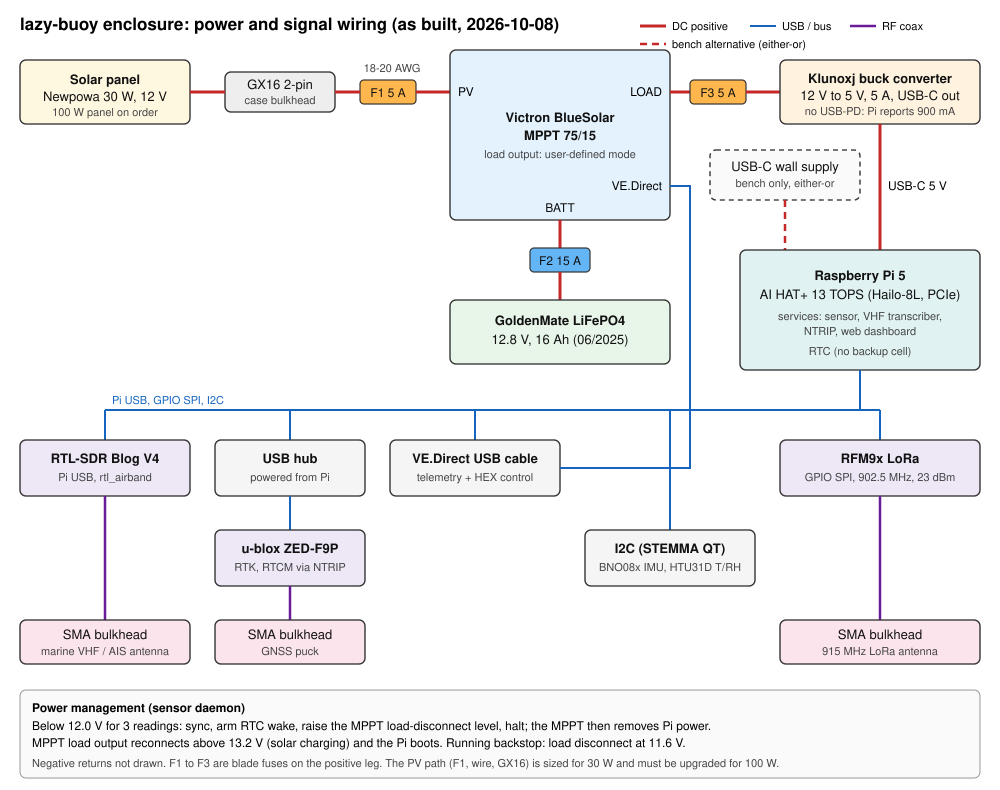

# Hardware: Enclosure, Power, and Wiring

As-built description of the lazy-buoy enclosure (Nanuk case), recorded 2026-10-08
from photographs and bench measurements.

## Components

| Function | Part | Interface | Notes |
| :--- | :--- | :--- | :--- |
| Compute | Raspberry Pi 5 | | Powered over USB-C; no RTC backup cell |
| AI accelerator | Raspberry Pi AI HAT+ 13 TOPS (Hailo-8L) | PCIe | Whisper tiny transcription |
| Charge controller | Victron BlueSolar MPPT 75/15 | VE.Direct (USB cable) | No Bluetooth; load output used to switch the Pi |
| Battery | GoldenMate LiFePO4, 12.8 V, 16 Ah (06/2025) | 6.3 mm spade terminals | Flat voltage curve: state of charge cannot be read from voltage |
| Solar panel | Newpowa 30 W, 12 V | 2-pin GX16 bulkhead | 100 W panel on order (see Upgrades) |
| 5 V supply | Klunoxj buck converter, 12 V to 5 V, 5 A | USB-C to the Pi | Does not advertise USB-PD current; the Pi reports a 900 mA supply |
| VHF receiver | RTL-SDR Blog V4 | Pi USB | rtl_airband, marine VHF channels |
| GNSS | u-blox ZED-F9P | USB via hub | RTK with NTRIP corrections |
| USB hub | unbranded, bus-powered | Pi USB | Powered from the Pi |
| LoRa radio | RFM9x | GPIO SPI | 902.5 MHz, 23 dBm |
| IMU | BNO08x | I2C (STEMMA QT) | |
| Temperature and humidity | HTU31D | I2C (STEMMA QT) | |
| Antenna entries | 3 SMA bulkheads | coax | Marine VHF/AIS, GNSS, 915 MHz LoRa |

## Power path and fusing

| Circuit | Fuse | Conductor | From | To |
| :--- | :--- | :--- | :--- | :--- |
| Solar (PV) | F1, 5 A blade | 18 to 20 AWG | GX16 bulkhead, positive pin | MPPT PV+ |
| Battery | F2, 15 A blade | | Battery positive | MPPT BATT+ |
| Load | F3, 5 A blade | | MPPT LOAD+ | Buck converter input positive |

Negative conductors run unfused to the matching MPPT terminals. On the bench, a
USB-C wall supply can replace the buck converter at the Pi's USB-C input; the two
sources are used either-or, never together. Shut the Pi down before switching sources.

## Power management

The sensor daemon (`src/sensor_lora_daemon.py`, flags in `configs/lhzn-sensor.service`)
reads the MPPT every 15 s and manages the load output over the VE.Direct HEX protocol:

| Condition | Action |
| :--- | :--- |
| Boot | Set MPPT load output to user-defined mode, disconnect 11.6 V, reconnect 13.2 V (written only if different) |
| Battery below 12.0 V for 3 consecutive valid readings | Sync, arm the RTC wake alarm (1 h), raise the MPPT disconnect level above the present voltage, halt |
| After halt | MPPT removes power from the load output; the RTC alarm is lost with power |
| Battery above 13.2 V (solar charging) | MPPT restores the load output; the Pi boots and the daemon restores the 11.6 V backstop |
| Frame without a voltage field, or below 6 V | Ignored (treated as a corrupt frame) |

## Upgrades required for the 100 W panel

The PV path is sized for the 30 W panel (short-circuit current about 1.8 A). The
100 W panel (short-circuit current 5.6 A) needs:

* F1 raised to 10 A (solar fuses are sized at 1.56 times short-circuit current or more).
* PV conductors of 14 AWG or heavier.
* A case entry rated above 10 A, such as an IP68 cable gland with MC4 leads, in place of the 2-pin GX16.

The MPPT 75/15 accepts the 100 W panel without other changes (open-circuit voltage
about 23 V against a 75 V limit; 5.6 A against a 15 A limit).

## Open items

* Confirm which USB devices sit on the hub and which on the Pi's own ports.
* Measure the 30 W panel's open-circuit voltage and short-circuit current in full
  sun; daily yields of 0 to 20 Wh on 2026-10-06 and 2026-10-07 are unexplained.
* Consider an always-on low-power supervisor that reports battery state while the
  Pi is off and can switch the buck converter input independently of the MPPT load
  output.
